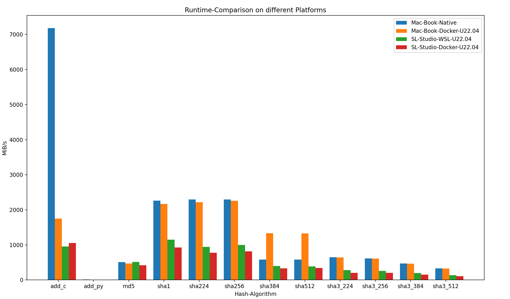

# Hash-Functions-Compare-Screen-Shot

The Hash-Functions-Compare-Screen-Shot is a [Screen-Shot](30000001.md) that shows a [Bar-Diagram](700046.md) of the Processing-Speed of different [Hash-Functions](13000019.md). The Diagram was created using the [Mathplotlib](2000202.md).

