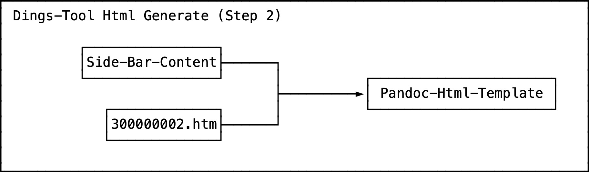

# Dings-Tool-Html-Generate-Step-2-Screen-Shot

The Dings-Tool-Html-Generate-Step-2-Screen-Shot is a [Screen-Shot](30000001.md) that shows a [Data-Flow-Diagram](700047.md) of the Html-Generation-[Process](60062.md) of the [Dings-Tool](13000019.md).

