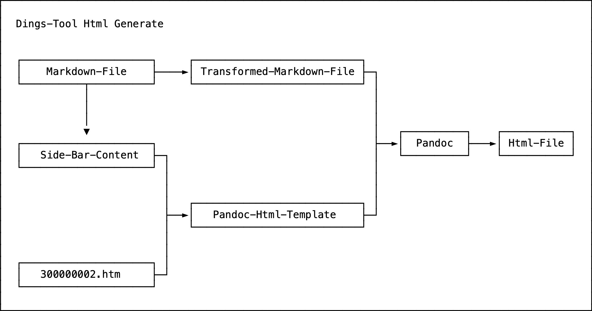

# Dings-Tool-Html-Build-Process

Dings-Tool-Html-Build-Process is a [Screen-Shot](30000001.md) that shows a [Data-Flow-Diagram](700047.md) of the [Dings-Tool](300020000.md) [Build-Process](600044.md) for generating the [Html-Pages](9000097.md) of the [Dings-Project](300000006.md).

